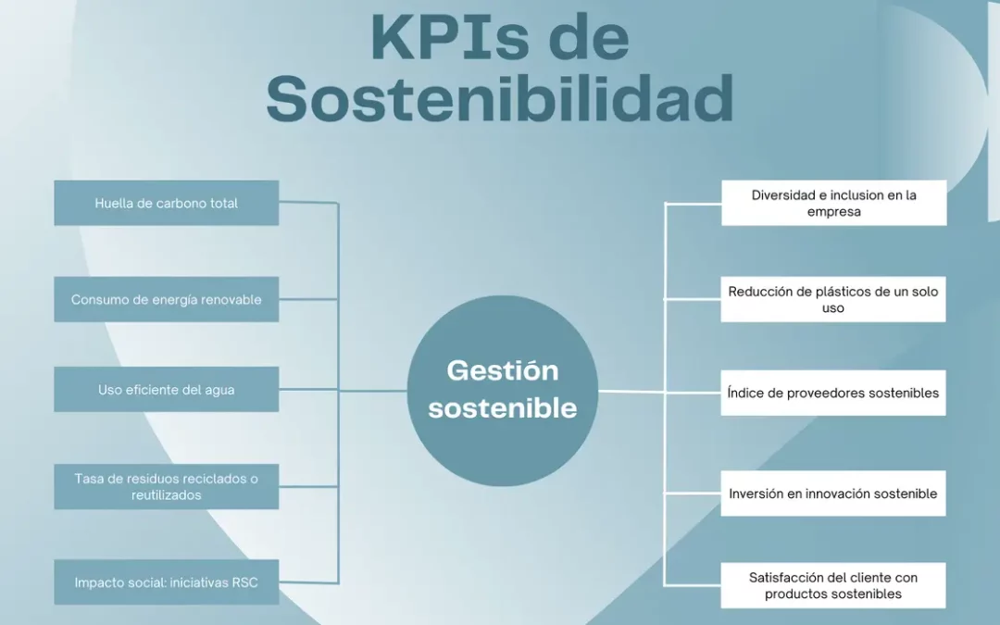
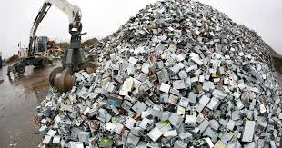
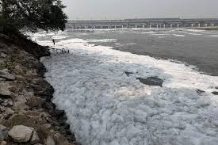
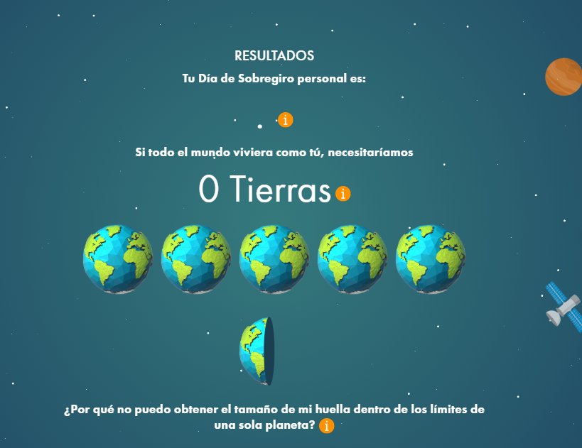
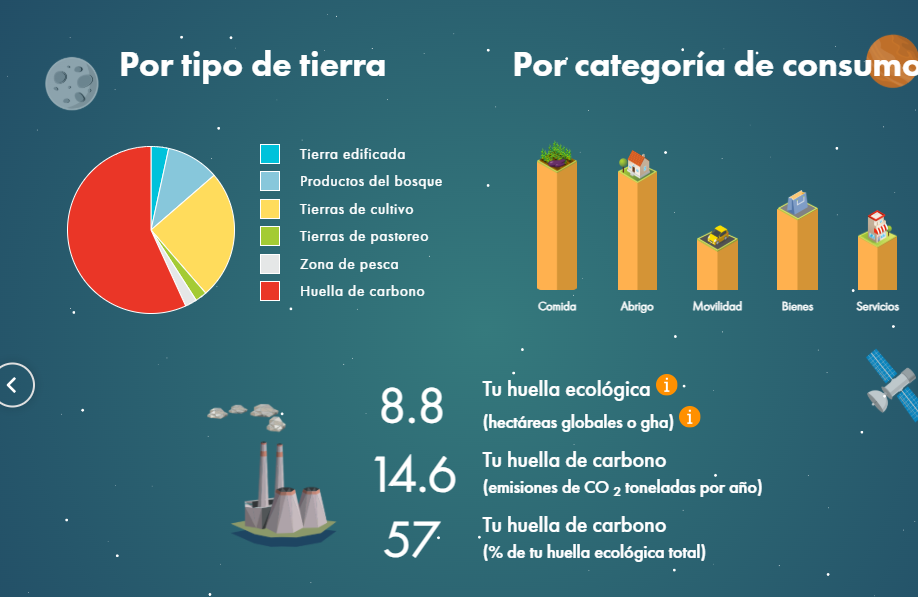

# Sostenibilidad2.0

### Viernes 23/01/2026

### Resumen de la clase de hoy

La clase de hoy ha tratado sobre el **plan de sostenibilidad empresarial**. La idea principal es que los recursos que se utilizan para fabricar productos son limitados y, por tanto, es fundamental **gestionarlos de manera sostenible** para evitar que se agoten.

Si un recurso se utiliza sin control, llega un momento en el que escasea y su precio sube. Esto no solo afecta al consumidor, sino también a las propias empresas.

#### Ejemplo explicado en clase

Si la **harina** escasea y una barra de pan pasa a costar **20 €**, la gente dejará de comprar pan.  
Como consecuencia, las panaderías venderán menos y muchas acabarán cerrando, haciendo que los panaderos ganen menos dinero o pierdan su trabajo.

Esto es lo que se entiende por **sostenibilidad empresarial**: asegurar que la actividad económica pueda mantenerse en el tiempo sin destruir los recursos de los que depende.  
Este análisis inicial se conoce como **diagnóstico inicial**.

---

### Ideas clave vistas en clase

- **La sostenibilidad no es una opción, es una condición de supervivencia.**
- **Ecodependencia:** dependemos del medio ambiente para sobrevivir y producir.
- **Translimitación:** estamos consumiendo más recursos de los que el planeta puede regenerar.
- **Cambio de paradigma:** es necesario cambiar la forma tradicional de producir y consumir.

---

### Grupos de interés

Las empresas no existen de forma aislada. Tienen **grupos de interés** (*stakeholders*), como:
- Clientes  
- Trabajadores  
- Proveedores  
- Sociedad  
- Medio ambiente  

Todos ellos se ven afectados por las decisiones empresariales.

---

### Indicadores KPIs

Los **KPIs** (indicadores clave de rendimiento) sirven para medir si una empresa está cumpliendo sus objetivos de sostenibilidad.  
Como se dijo en clase: **“lo que no se mide, no mejora”**.

Para ello, es necesario elaborar un **informe o documento** donde se recojan datos, objetivos y resultados.

---

### Pregunta de hoy  
#### ¿El *greenwashing* sirve para algo?

En mi opinión, **sí tiene cierto sentido**, pero con matices. El *greenwashing* puede servir para generar conciencia y hacer que las empresas empiecen a hablar de sostenibilidad. Sin embargo, si no va acompañado de cambios reales, se queda solo en imagen y marketing.

Lo importante no es parecer sostenible, sino **usar de forma responsable los recursos necesarios para la producción empresarial**, ya que de ello depende la supervivencia de la propia empresa a largo plazo.

### Viernes 16/01/2026
### Resumen de la clase de hoy
Agenda 2030 y los Objetivos de Desarrollo Sostenible:

---

### ¿Qué son los Objetivos de Desarrollo Sostenible?

Los **ODS** son un conjunto que tratan temas muy variados, como:

- Fin de la pobreza  
- Hambre cero  
- Salud y bienestar  
- Educación de calidad  
- Igualdad de género  
- Energía asequible y no contaminante  
- Acción por el clima  
- Producción y consumo responsables  

Todos estos objetivos buscan mejorar la calidad de vida de las personas sin dañar el planeta.

---

### ¿Por qué son importantes los ODS?

Son importantes porque:
- Afectan directamente a nuestra forma de vivir ahora.
- Intentan reducir desigualdades entre países y personas.
- Promueven un uso más responsable de los recursos naturales.
- Involucran tanto a gobiernos como a empresas y ciudadanos.

---

### ¿Qué relación tiene la Agenda 2030 conmigo?

Aunque pueda parecer algo lejano, la Agenda 2030 también nos afecta a nivel personal. Acciones como consumir de forma responsable, reducir residuos, usar tecnología de manera eficiente o apoyar la igualdad social están directamente relacionadas con los ODS.

---

### La pregunta de hoy

#### ¿Se van a conseguir los Objetivos de Desarrollo Sostenible?

Es difícil que los **Objetivos de Desarrollo Sostenible** se cumplan al 100 % antes de 2030. Algunos avances se han logrado, pero muchos objetivos van más lentos de lo esperado debido a factores como conflictos armados, desigualdades económicas, crisis climática y falta de compromiso real por parte de algunos gobiernos y empresas.

Aun así, eso no significa que los ODS no sirvan para nada. Aunque no se alcancen completamente, funcionan como una **guía** que marca el camino a seguir y ayudan a que los países, las empresas y la sociedad sean más conscientes de los problemas globales.

En definitiva, puede que no se cumplan todos los objetivos, pero intentarlo ya supone un avance importante frente a no hacer nada.

### Conclusión

La Agenda 2030 y los Objetivos de Desarrollo Sostenible nos recuerdan que los problemas globales necesitan soluciones colectivas. 
Aunque no podamos cambiar el mundo de golpe, nuestras decisiones diarias sí cuentan. Entender los ODS es el primer paso para ser más conscientes de nuestro impacto y actuar de forma más responsable como ciudadanos.

### Viernes 9/12/2026

### Resumen de la clase de hoy

El tema de la clase de hoy es **Contaminación y Residuos**, bajo el concepto de  
**“Tu huella digital y física”**.

#### ¿Qué es la contaminación?
La contaminación es la **introducción de sustancias o elementos dañinos en un entorno natural**, alterando su equilibrio y causando efectos negativos en los seres vivos y los ecosistemas.  
Se produce principalmente por actividades humanas como la industria, el transporte y la mala gestión de residuos.

#### ¿Qué es un residuo?
Un residuo es **cualquier sustancia u objeto que se desecha tras su uso o consumo**.  
En muchos casos, los seres humanos decidimos enterrarlos en vertederos porque consideramos que ya no tienen valor, no pueden reutilizarse y han perdido su utilidad.

En la imagen vemos una **montaña de basura electrónica**, resultado del consumo masivo de dispositivos tecnológicos y de su corta vida útil.

---

#### Bioacumulación: ¿qué es?
La **bioacumulación** es el proceso por el cual **sustancias contaminantes** (como metales pesados, pesticidas o productos químicos) **se van acumulando en el interior de los organismos vivos** con el paso del tiempo.  
Esto ocurre porque el organismo absorbe estas sustancias más rápido de lo que puede eliminarlas, lo que puede provocar efectos tóxicos incluso con exposiciones pequeñas pero continuas.

---

Ríos incendiados por **vertidos de hidrocarburos**, procedentes de refinerías cercanas o instalaciones industriales colindantes.

Ríos cubiertos por **espuma tóxica**, causada por vertidos industriales y productos químicos.

---

La idea principal del sistema actual es **maximizar el beneficio económico**, por lo que los residuos pueden recorrer un largo camino antes de desaparecer de nuestra vista.  
La **contaminación** y los **residuos** van de la mano, pero **no son lo mismo**: los residuos son el origen y la contaminación es una de sus consecuencias.

---

### ¿Por qué cambias de móvil?  
*(Pregunta planteada hoy en clase)*

En mi caso, intento cambiar de móvil lo mínimo posible, ya que considero innecesario hacerlo con frecuencia.  
Las veces que he cambiado de móvil ha sido porque el anterior ha sufrido algún accidente que ha provocado que deje de funcionar. Estos accidentes pueden ir desde que se caiga al váter del cuarto de baño hasta pisarlo accidentalmente con la rueda del coche.

Los modelos de móvil que uso nunca superan los 150 €, ya que marcas como Xiaomi ofrecen una buena relación calidad-precio.

### Viernes 19/12/2025
### Resumen de la clase de hoy 
Punto uno, hablamos sobre el plan que tenemos estas vacaciones.(Alguno más interesante que otro la verdad)
Punto dos, hablamos sobre el primer problema de la bajante y de los sistemas de alcantarillado que son "Las Tuallitas" 

### Viernes 12/12/2025

### Resumen de la clase de hoy

Hoy hablamos sobre el **cambio climático**, que justifica de manera política y social la necesidad de hablar de **sostenibilidad**. Dentro de todas las amenazas que ponen en riesgo la vida humana, el cambio climático es una de las que se percibe como más reales y cercanas. Además, genera una gran preocupación a nivel institucional, hasta el punto de que los **ministros de defensa** le prestan especial atención.

#### Causas y consecuencias del cambio climático

- **Aumento de la temperatura global**, provocado principalmente por la emisión de gases de efecto invernadero.
- **Eventos climáticos extremos**, como olas de calor, sequías prolongadas, inundaciones, incendios forestales y tormentas más intensas.
- **Escasez de recursos**, especialmente agua y alimentos, que puede generar tensiones sociales.
- **Subida del nivel del mar**, que amenaza a ciudades costeras y provoca desplazamientos de población.
- **Pérdida de biodiversidad**, afectando al equilibrio de los ecosistemas.

---

### ¿Por qué los ministros de defensa consideran el cambio climático un tema de seguridad nacional?

El cambio climático es un problema de **seguridad nacional** porque actúa como un *multiplicador de amenazas*. Puede provocar conflictos por recursos naturales, desplazamientos masivos de población (migraciones climáticas), inestabilidad política y crisis humanitarias. Además, los desastres naturales pueden afectar infraestructuras críticas, bases militares y la capacidad de respuesta de los Estados. Por ello, los ministerios de defensa lo analizan como un riesgo estratégico que puede aumentar la probabilidad de conflictos y desestabilizar regiones enteras.

### La pregunta de hoy

#### ¿Cuál es el mayor emisor de CO₂?

El mayor emisor de CO₂ a nivel global es el **sector energético**, especialmente la **quema de combustibles fósiles** como el carbón, el petróleo y el gas natural para producir electricidad, calor y transporte.  
A nivel de países, **China**, **Estados Unidos** y **India** se encuentran entre los mayores emisores debido a su tamaño, población y modelo energético. Sin embargo, el problema no se limita a un solo país, ya que el cambio climático es un fenómeno **global** causado por la suma de las emisiones de todos.

---

#### ¿Qué puedo hacer yo como programador para mitigar el cambio climático?

Como programador, también se puede contribuir a la lucha del cambio climático desde el ámbito profesional:

- **Desarrollar software eficiente**, que consuma menos recursos computacionales y, por tanto, menos energía.
- **Optimizar el uso de servidores y la nube**, reduciendo procesos innecesarios y mejorando la eficiencia del código.
- **Apoyar proyectos de sostenibilidad**, como aplicaciones para el ahorro energético, la movilidad sostenible o la gestión eficiente de recursos.
- **Elegir proveedores tecnológicos responsables**, que utilicen energías renovables en sus centros de datos.
- **Concienciar desde la tecnología**, creando herramientas que ayuden a medir, visualizar y reducir el impacto ambiental.

Aunque la programación no parece contaminante de forma directa, el mundo digital también tiene una huella ambiental, y un uso responsable de la tecnología puede marcar una diferencia real.

======
### Viernes 05/12/2025
### Resumen de la clase de hoy

En la clase de hoy hemos comentado ideas sobre la huella ecológica y la de carbono.

---

### Una breve explicación

**Huella ecológica:** es la cantidad de recursos naturales que utilizamos y la cantidad de desechos que generamos. Representa el impacto que provocamos en el planeta, incluyendo el uso de energía, agua, alimentos, transporte y los residuos que producimos.

**Huella de carbono:** es la cantidad de gases de efecto invernadero (principalmente CO₂) que emitimos debido a nuestras actividades. Antes existía un equilibrio natural, pero los seres humanos estamos emitiendo CO₂ en una cantidad que acelera el proceso natural del clima, aumentando el calentamiento global. Esta huella ha ido incrementándose con los años.

**Huella digital:** hace referencia al rastro que dejamos cuando usamos herramientas tecnológicas: nuestras actividades en línea, búsqueda de información, redes sociales, datos que compartimos, etc.

**Estrategias de mitigación:** son acciones para reducir nuestro impacto: consumir responsablemente, ahorrar energía, reciclar, reutilizar y compensar a la naturaleza aquello que extraemos de ella.

---

### ¿Cuál es mi huella de carbono?
Comprobamos nuestra huella de carbono en la web footprintcalculator.org
las preguntas que se realizan en la web estan muy bien, pero el sistema pone muy dificil ser sostenible, ya que no fomenta el consumo de producto obtenidos de manera natural, aún menos producirlos uno mismo.

### Viernes 28/11/2025
### Resumen de la clase de hoy
Hoy hemos visto la diferencia entre la economía lineal y la economía circular.
La economía lineal sigue el modelo de “tomar, hacer y desechar”, mientras que la circular busca reducir, reutilizar y reciclar para cerrar el ciclo de los recursos.

Pregunta: “¿Y a mí qué me cuentas?” ¿Enfoque colectivo o individual?
1. “¿Y a mí qué me cuentas?”

Aunque parezca algo lejano, la economía lineal me afecta en mi día a día:

Pago más por los productos, porque muchos están diseñados para durar poco o no repararse.

Genero más basura, y esa basura vuelve a mi entorno: mi barrio, mi ciudad y, al final, mi salud.

Se agotan los recursos, y lo que hoy es barato mañana puede ser escaso y mucho más caro.

Influye en mi futuro laboral, porque los modelos lineales son más frágiles, mientras que la economía circular crea nuevas oportunidades en reparación, reutilización y gestión de materiales.

En resumen, la economía circular no es solo “algo global”, también me beneficia directamente: productos más duraderos, menos residuos y un sistema económico más estable.

2. ¿El ecodiseño en qué me afecta?

El ecodiseño me afecta porque influye directamente en la calidad y el uso de los productos que compro. Cuando algo está diseñado con criterios ambientales:

Me dura más tiempo, porque se piensa para ser resistente y fácil de reparar.

Me cuesta menos, ya que no tengo que reemplazarlo tan rápido.

Genero menos residuos, porque los materiales se pueden reutilizar o reciclar mejor.

Consumo con más sentido, porque sé que detrás del producto hay un diseño que busca reducir el impacto ambiental desde el principio.

En resumen, el ecodiseño mejora mi día a día porque me ofrece productos más prácticos, económicos y sostenibles sin que yo tenga que hacer un esfuerzo extra..
>>>>>>> 444c4b26303c38369763a3a832b6c7ee0b4ad7c3

### Viernes 21/11/2025
Este viernes no hubo clase

### Viernes 14/11/2025

### Resumen de la clase de hoy
*(La novedad de hoy es que deberemos introducir una imagen)*

Hablamos sobre la diferencia entre el peso de un producto final —por ejemplo, un móvil de 150 gramos— y el peso de los residuos que se generan en el ciclo de vida de la creación de un producto.  
A esto se le llama **peso oculto**.

También hablamos sobre las energías disponibles en la Tierra: solar, eólica, hidroeléctrica, nuclear y geotérmica.  
Llegamos a la conclusión de que las dos grandes fuentes de energía son la **solar** y la **nuclear**.

Comentamos ideas como **Economía Lineal** y **Economía Circular**.

---

### Análisis de Ciclo de Vida

1. **Materias Primas:** Extracción de recursos de la Tierra.  
2. **Fabricación:** Proceso industrial, ensamblaje y embalaje del producto.  
3. **Distribución:** Transporte del producto final a las tiendas.  
4. **Uso:** La vida del producto con el consumidor, incluido el mantenimiento.  
5. **Gestión Final:** Desecho del producto (vertedero, reciclaje o reutilización).

---

La pregunta que nos hacemos en este punto es:  
**Elegimos uno de estos pasos para preguntar a la IA sobre el ciclo de vida de un producto.**  
Por ejemplo: *el ciclo de vida de un coche eléctrico*.
### Yo eligo en paso 1º Materias Primas en el Ciclo de Vida de un Coche Eléctrico

La etapa de **materias primas** consiste en la extracción y obtención de los recursos necesarios para fabricar las distintas partes de un coche eléctrico. Esta fase tiene un gran impacto ambiental, ya que implica minería, transporte de materiales y consumo de energía.

**Principales materias primas necesarias:**

- **Litio:** Utilizado en las baterías de iones de litio.  
- **Cobalto:** Mejora el rendimiento y estabilidad de las baterías.  
- **Níquel:** Aumenta la capacidad energética de las celdas.  
- **Grafito:** Material clave para los electrodos de la batería.  
- **Cobre:** Necesario para el cableado y el motor eléctrico.  
- **Aluminio y acero:** Para la carrocería, el chasis y componentes estructurales.  
- **Tierras raras (neodimio, lantano, etc.):** Usadas en motores eléctricos con imanes permanentes.

**Impactos ambientales principales:**

- Consumo elevado de agua en la extracción de litio.  
- Minería intensiva que puede generar contaminación del suelo y pérdida de biodiversidad.  
- Emisiones derivadas del transporte de materias primas a las fábricas.  
- Condiciones laborales y sociales problemáticas en regiones con minería de cobalto.

### Viernes 7/11/2025
No hubo clase

# Noviembre

### Viernes 31/10/2025

En la clase de hoy:

Hablamos sobre que los humanos son animales, que los recursos del planeta son finitos y que **no todos los recursos del planeta están al alcance de todos**.  
Además, aunque existan recursos naturales, el **consumo es creciente** —cada vez somos más—, lo que genera conflictos entre la población.

Comentamos que las zonas con ríos tienen más disponibilidad de agua, mientras que en **Jumilla** no hay ninguno.  
Sin embargo, sí hay **acuíferos**, por lo que es necesario construir **pozos** para acceder y extraer agua, tanto para el **uso agrícola** como para el **consumo humano**.

También hablamos sobre el **concepto de las tres dimensiones**, algo que no conocía.

Las tres dimensiones son:

- **Social**
- **Económica**
- **Ambiental**

=======
>>>>>>> Stashed changes

### Viernes 24/10/2025

En la clase hoy, el punto fuerte desde mi punto de vista de lo que hemos hablado se trata de las estrategias de sostenibilidad 'K' y 'R'. Por lo que yo he entendido, estas estrategias son conceptos sobre cómo las especies se adaptan a su entorno.

- Las especies R se reproducen en más cantidad y más rápido, y aprovechan eso como un recurso.  
- Las especies K se reproducen en menos cantidad y se enfocan en la supervivencia, consumiendo los recursos de forma lo más eficiente posible.

La pregunta que se ha planteado hoy es: **¿Los humanos somos K o R?**  

> Los humanos se consideran principalmente especies K, porque tendemos a tener menos descendencia y dedicamos mucho tiempo y recursos a cuidar a cada individuo, asegurando su supervivencia. Esto refleja una estrategia de vida enfocada en calidad sobre cantidad, típica de entornos más estables, lo que también se relaciona con cómo gestionamos y usamos los recursos en sostenibilidad.

### Viernes 17/10/2025

En la clase de hoy comentamos conceptos sobre que "Los seres humanos también formamos parte del ecosistema".

Se nos plantea una pregunta sobre "¿Qué hacemos nosotros: cooperamos o competimos?"
A la que mi compañero Pedro a hecho un comentario cual me parece muy adecuado, su respuesta a sido: "depende de lo que me interese", lo cual me parece muy adecuado o una respuesta muy adecuada a la pregunta que se nos ha planteado.

En la clase de hoy no me a quedado claro los conceptos sobre los que hemos hablado, la verdad.
Lo que he sacado en claro es que el ser humano es el único que actua por intereses como la códicia, llegando a usar escopetas.
Que la naturaleza simplemente cubre intereses básicos como supervivencia.

### Viernes 10/10/2025

En la clase de hoy comentamos conceptos e ideas sobre "El límnite del ecosistema".

Capacidad de carga, es el límite máximo de individuos que un ecosistema puede soportar sin degradarse.

El ecosistema es límitado, Mantener la capacidad de carga asegura la salud y funcionalidad sosteniblie del ecositema a largo plazo.

Todas estas ideas y conceptos nos hacen pensar en el límite poblacional que podemos tener los humanos en nuestro planeta.
Ya que lo recursos son límitados y debemos aprovecharlos todo lo posible y de una manera no abusiva, hay entra en juego la palabra "Sostenibilidad".

Por ejemplo: la idea consiste en talar un árbol y plantar otro uno nuevo en su lugar (pues esto con todo).
Esta es la mi opinión de lo que tratado la clase de hoy.

### Viernes 3/10/2025
Ha esta clase no pude asistir.
Preguntaré en que a consistido para poder hacer mi comentario sobre la clase.
Mi grupo y yo tomamos la decisión de elegir la civilización sobre la que vamos a investigar para nuestro proyecto de sostenibilidad.
Elegimos la civilización de "Los Sumerios".

## Octubre

### Viernes 26/09/2025
En la clase de hoy hemos hablado sobre la si es rentable y posible la sostenibilidad en el tiempo.
Si es más barato o apropiado para las empresas o por qué y en que les beneficia.
No es necesario ser ecologista para poder preocuparse con estas cosas.(Cambio de prueba)
También hemos recordado que debemos pensar sobre que civilización hacer el trabajo sobre la civilización.
Civilizacón ficticia o real.
De donde obtenia los recurso.
Por qué desaparecio.

### Viernes_19_Septiempre
Primera clase de sostenibilidad:
De momento todo bien, aún no a dado tiempo a mucho. 
Por lo que he visto esta clase va de la filosofía de todo lo relacionado con ser verde y ecológico.

## Semptiembre